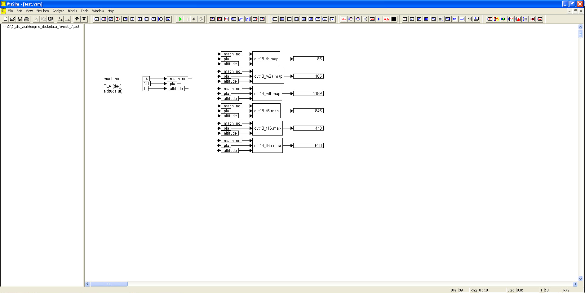

# ========================================
# Utility to Create VISSIM Map Input Files From Engine Deck Table Output For Different ATM Models:
# ========================================

## Utility to Create VISSIM Map Input Files From Engine Deck Table Output For Different Atmosphere Models.

##
## I. Test of Created VISSIM Map Input Files:

##
## II. VISSIM Operation: "./VISSIM/test.vsm"

##
## III. Utility Executable: "./bin/data_format.exe"

##
## IV. Utility Input Files:
### IV.a. "./atm_cold_day/input/out18.txt"
### IV.b. "./atm_cold_day_1976/input/out18.txt"
### IV.c. "./atm_hot_day/input/out18.txt"
### IV.d. "./atm_hot_day_1976/input/out18.txt"
### IV.e. "./atm_polar_day/input/out18.txt"
### IV.f. "./atm_standard_day/input/out18.txt"
### IV.g. "./atm_standard_day_1976/input/out18.txt"
### IV.h. "./atm_tropical_day/input/out18.txt"

##
## V. Utility Output Files:
### V.a. "./atm_cold_day/output/":
    1. out18_fn.map
    2. out18_pamb.map
    3. out18_ps9.map
    4. out18_pt9.map
    5. out18_ptblc.map
    6. out18_ptbli.map
    7. out18_rho9.map
    8. out18_t16.map
    9. out18_t6.map
    10. out18_t6a.map
    11. out18_tamb.map
    12. out18_ts9.map
    13. out18_tt2p5c.map
    14. out18_tt6c.map
    15. out18_tt9.map
    16. out18_ttblc.map
    17. out18_ttbli.map
    18. out18_v9.map
    19. out18_w2a.map
    20. out18_w2ar.map
    21. out18_wft.map
    22. out18_xm9.map

### V.b. "./atm_cold_day_1976/output/"
    1. thru 22. (same as above)
### V.c. "./atm_hot_day/output/"
    1. thru 22. (same as above)
### V.d. "./atm_hot_day_1976/output/"
    1. thru 22. (same as above)
### V.e. "./atm_polar_day/output/"
    1. thru 22. (same as above)
### V.f. "./atm_standard_day/output/"
    1. thru 22. (same as above)
### V.g. "./atm_standard_day_1976/output/"
    1. thru 22. (same as above)
### V.h. "./atm_tropical_day/output/"
    1. thru 22. (same as above)
